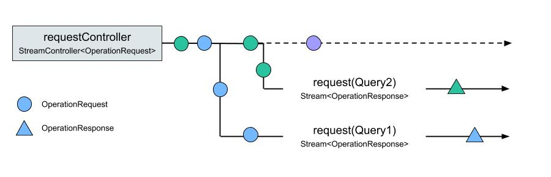

Any functional GraphQL client includes three major components:

1. A network interface to communicate with a GraphQL server
2. A Cache to store the data returned from the server
3. A management layer that routes GraphQL Operations to the network or cache

Ferry was designed to be small and modular.

The network interface is offloaded to the `gql_link` package, caching is done by `ferry_cache`, and the core `ferry` client handles the routing and management of GraphQL Operations.

## How the Client Works

In Ferry, each GraphQL Operation (including Queries, Mutations & Subscriptions) is wrapped in an `OperationRequest`, which includes the GraphQL document for the operation, any variables used in the operation, and any additional configuration need to correctly execute the request (or trigger a side effect, such as an optimistic cache update).

The core Ferry Client has a very simple API, consisting of:

1. **`Client.requestController`**: a single StreamController that receives all `OperationRequest`s.
2. **`Client.responseStream()`**: a method that, given a specific `OperationRequest`, filters the `requestController` for only those events, resolves the request via the Cache or network (depending on the `OperationRequest.FetchPolicy`), and returns a Stream of `OperationResponse`s.

## Packages

Here's a full list of Ferry pacakges, along with a short description of each:

| Pub                                                                      | Package                                                       | Description                                     |
| ------------------------------------------------------------------------ | ------------------------------------------------------------- | ----------------------------------------------- |
| [![version][package:ferry:version]][package:ferry]                       | [`package:ferry`][package:ferry:source]                       | Stream-based GraphQL Client                     |
| [![version][package:ferry_cache:version]][package:ferry_cache]           | [`package:ferry_cache`][package:ferry_cache:source]           | Normalized GraphQL Cache                        |
| [![version][package:ferry_flutter:version]][package:ferry_flutter]       | [`package:ferry_flutter`][package:ferry_flutter:source]       | Flutter Widgets for GraphQL Operations          |
| [![version][package:ferry_generator:version]][package:ferry_generator]   | [`package:ferry_generator`][package:ferry_generator:source]   | Dart Type Generator for GraphQL Operations      |
| [![version][package:ferry_store:version]][package:ferry_store]           | [`package:ferry_store`][package:ferry_store:source]           | Data Persistence for `ferry_cache`              |
| [![version][package:ferry_hive_store:version]][package:ferry_hive_store] | [`package:ferry_hive_store`][package:ferry_hive_store:source] | Hive implementation of `ferry_store`            |
| [![version][package:normalize:version]][package:normalize]               | [`package:normalize`][package:normalize:source]               | Normalization / denormalization of GraphQL data |

[package:ferry:source]: https://github.com/gql-dart/ferry/tree/master/ferry/README.md
[package:ferry]: https://pub.dartlang.org/packages/ferry
[package:ferry:version]: https://img.shields.io/pub/v/ferry.svg?style=flat-square 
[package:ferry_cache:source]: https://github.com/gql-dart/ferry/tree/master/ferry_cache/README.md
[package:ferry_cache]: https://pub.dartlang.org/packages/ferry_cache
[package:ferry_cache:version]: https://img.shields.io/pub/v/ferry_cache.svg?style=flat-square
[package:ferry_flutter:source]: https://github.com/gql-dart/ferry/tree/master/ferry_flutter/README.md
[package:ferry_flutter]: https://pub.dartlang.org/packages/ferry_flutter
[package:ferry_flutter:version]: https://img.shields.io/pub/v/ferry_flutter.svg?style=flat-square 
[package:ferry_generator:source]: https://github.com/gql-dart/ferry/tree/master/ferry_generator/README.md
[package:ferry_generator]: https://pub.dartlang.org/packages/ferry_generator
[package:ferry_generator:version]: https://img.shields.io/pub/v/ferry_generator.svg?style=flat-square 
[package:ferry_store:source]: https://github.com/gql-dart/ferry/tree/master/ferry_store/README.md
[package:ferry_store]: https://pub.dartlang.org/packages/ferry_store
[package:ferry_store:version]: https://img.shields.io/pub/v/ferry_store.svg?style=flat-square 
[package:ferry_hive_store:source]: https://github.com/gql-dart/ferry/tree/master/ferry_hive_store/README.md
[package:ferry_hive_store]: https://pub.dartlang.org/packages/ferry_hive_store
[package:ferry_hive_store:version]: https://img.shields.io/pub/v/ferry_hive_store.svg?style=flat-square 
[package:normalize:source]: https://github.com/gql-dart/ferry/tree/master/normalize/README.md
[package:normalize]: https://pub.dartlang.org/packages/normalize
[package:normalize:version]: https://img.shields.io/pub/v/normalize.svg?style=flat-square 
